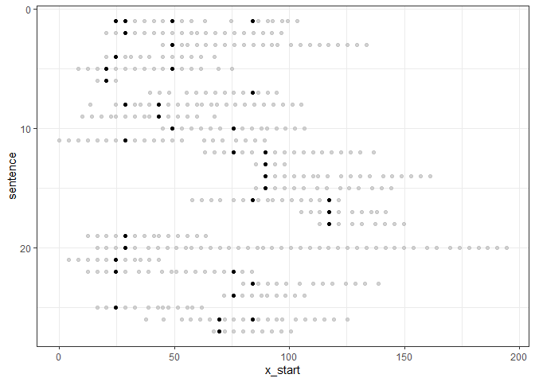
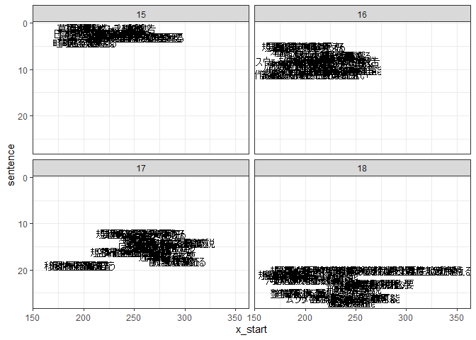

<!-- README.md is generated from README.Rmd. Please edit that file -->

# anabass

The goal of anabass is to analyse basic structure of sentences for
better writeings.

anabass is from a name of fish ginus anabas. anabas was is thought to
climb tree, but not in actual.

## Installation

You can install the development version from
[GitHub](https://github.com/) with:

``` r
# install.packages("remotes")
remotes::install_github("matutosi/anabass")
```

<!--
You can also install from CRAN:

``` r
install.packages("anabass")
```
 -->

## Example

You can use `fun()` to analyse basic structure.

``` r
library(anabass)
#> 
#> Attaching package: 'anabass'
#> The following object is masked from 'package:stringr':
#> 
#>     sentences
library(dplyr)
library(ggplot2)

devtools::load_all(".")
#> ℹ Loading anabass
library(moranajp)
review_sentences <- 
  review_chamame |>
  unescape_utf() |>
  add_sentence_no() |>
  clean_up() |>
  dplyr::filter(chap == 5) |>
  dplyr::select(sentence, word = "\u539f\u5f62") |>
  dplyr::filter(word != "") |>
  dplyr::group_by(sentence) |>
  dplyr::summarise(word = reduce(word, paste, sep = ";")) |>
  `$`(_, "word") |>
  stringr::str_split(";")

df <- connect_sentences(review_sentences)

df |>
  ggplot2::ggplot(ggplot2::aes(x = x_start, y = sentence, label = word)) +
  ggplot2::geom_point() +
  gghighlight::gghighlight(highlight == TRUE, label_key = word) +
  ggplot2::scale_y_reverse() +
  ggplot2::theme_bw()
#> Too many data points, skip labeling
```



``` r

df <- 
  review_chamame |>
  unescape_utf() |>
  dplyr::filter(chap == 5) |>
  add_sentence_no() |>
  dplyr::distinct(sect, para, sentence) |> 
  dplyr::right_join(df)
#> Joining with `by = join_by(sentence)`

df |>
  ggplot2::ggplot(ggplot2::aes(x = x_start, y = sentence, label = word)) +
  ggplot2::geom_text() +
  ggplot2::scale_y_reverse() +
  ggplot2::theme_bw() + 
  ggplot2::facet_wrap(vars(para))
```



## Citation

Toshikazu Matsumura (2024) anabass: Analyse Basic Structure of Sentences
for Better Writing. <https://github.com/matutosi/anabass/>.
